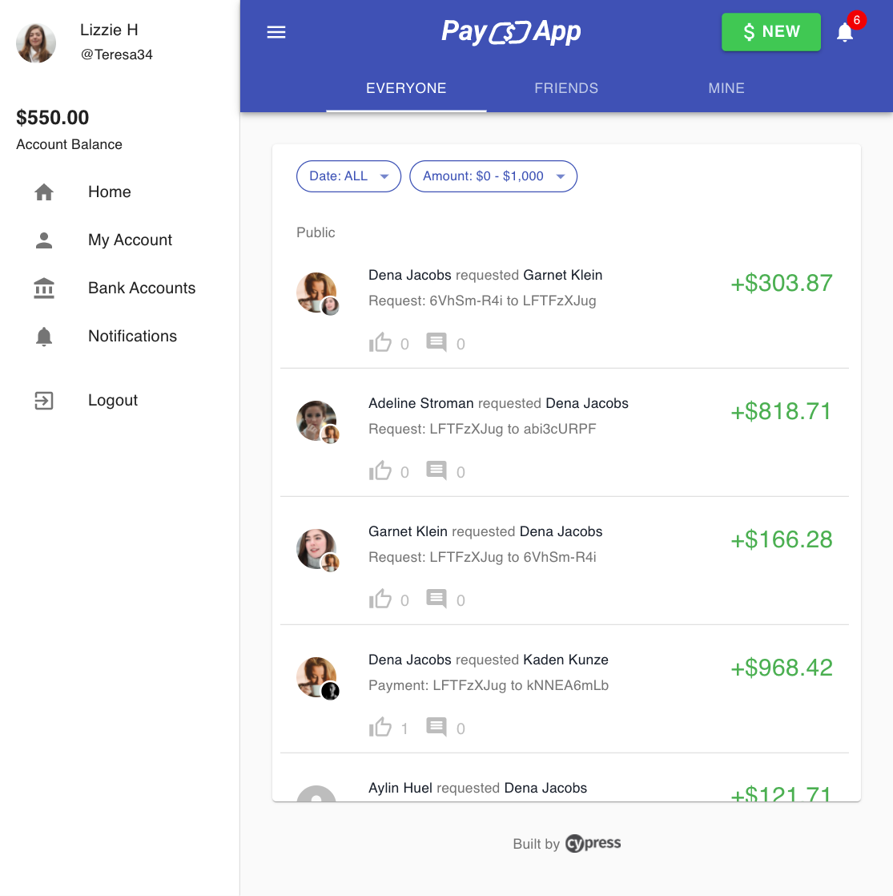

<p style='color: #3f51b5' align="center">
  
</p>

A payment application to demonstrate **real-world** usage of [Cypress](https://cypress.io) testing methods, patterns, and workflows.

<p align="center">
  
</p>

## Features

🛠 Built with React, XState, Express, Lowdb, & TypeScript  
⚡️ Zero database dependencies  
🚀 Full-stack Express/React application with real-world features and tests  
👮‍♂️ Local Authentication  
🔥 Database Seeding with End-to-end Tests  
💻 CI/CD + [Cypress Dashboard](https://cypress.io/dashboard)

## Getting Started

```
yarn install
yarn dev
```

<br />
<br />
<br />
<br />
<p style='color: "#3f51b5"' align="center">
  
</p>
