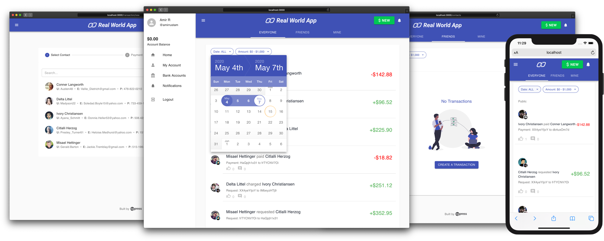

<p align="center">
  <!-- We use two SVGs here so that this displays correctly
    on Github. This might not look right in other Markdown previewers. -->
  
  
</p>

<p align="center">
  <a href="https://cypress.io">
    
    </a>
</p>

<p align="center">
   <a href="https://cloud.cypress.io/projects/7s5okt/runs">
    
  </a>

  <a href="https://codecov.io/gh/cypress-io/cypress-realworld-app">
    
  </a>

  <a href="https://percy.io/cypress-io/cypress-realworld-app">
    
  </a>

   <a href="#contributors-">
    
  </a>
</p>

<p align="center">
A payment application to demonstrate <strong>real-world</strong> usage of <a href="https://cypress.io">Cypress</a> testing methods, patterns, and workflows.
</p>

<p align="center">
  
</p>

> 💬 **Note from maintainers**
>
> This application is purely for demonstration and educational purposes. Its setup and configuration resemble typical real-world applications, but it's not a full-fledged production system. Use this app to learn, experiment, tinker, and practice application testing with Cypress.
>
> Happy Testing!

---

## Features

🛠 Built with [React][reactjs], [XState][xstate], [Express][express], [lowdb][lowdb], [Material-UI][material-ui] and [TypeScript][typescript]
⚡️ Zero database dependencies
🚀 Full-stack [Express][express]/[React][reactjs] application with real-world features and tests
👮‍♂️ Local Authentication
🔥 Database Seeding with End-to-end Tests
💻 CI/CD + [Cypress Cloud][cypresscloud]

## Getting Started

The Cypress Real-World App (RWA) is a full-stack Express/React application backed by a local JSON database ([lowdb]).

The app is bundled with [example data](./data/database.json) (`data/database.json`) that contains everything you need to start using the app and run tests out-of-the-box.

> 🚩 **Note**
>
> You can login to the app with any of the [example app users](./data/database.json#L2). The default password for all users is `s3cret`.
> Example users can be seen by running `yarn list:dev:users`.

### Prerequisites

This project requires [Node.js](https://nodejs.org/en/) to be installed on your machine. Refer to the [.node-version](./.node-version) file for the exact version.

[Yarn Classic](https://classic.yarnpkg.com/) is also required. Once you have [Node.js](https://nodejs.org/en/) installed, execute the following to install the npm module [yarn](https://www.npmjs.com/package/yarn) (Classic - version 1) globally.

```shell
npm install yarn@latest -g
```

If you have Node.js' experimental [Corepack](https://nodejs.org/dist/latest/docs/api/corepack.html) feature enabled, then you should skip the step `npm install yarn@latest -g` to install Yarn Classic globally. The RWA project is locally configured for `Corepack` to use Yarn Classic (version 1).

#### Yarn Modern

**This project is not compatible with [Yarn Modern](https://yarnpkg.com/) (version 2 and later).**

### Installation

To clone the repo to your local system and install dependencies, execute the following commands:

```shell
git clone https://github.com/cypress-io/cypress-realworld-app
cd cypress-realworld-app
yarn
```

#### Mac users with M-series chips will need to prepend `PUPPETEER_SKIP_CHROMIUM_DOWNLOAD=true`.

```shell
PUPPETEER_SKIP_CHROMIUM_DOWNLOAD=true yarn install
```

### Run the app

```shell
yarn dev
```

> 🚩 **Note**
>
> The app will run on port `3000` (frontend) and `3001` (API backend) by default. Please make sure there are no other applications or services running on both ports.
> If you want to change the default ports, you can do so by modifying `PORT` and `VITE_BACKEND_PORT` variables in `.env` file.
> However, make sure the modified port numbers in `.env` are not committed into Git since the CI environments still expect the application to run on the default ports.

### Start Cypress

```shell
yarn cypress:open
```

> 🚩 **Note**
>
> If you have changed the default ports, then you need to update Cypress configuration file (`cypress.config.ts`) locally.
> There are three properties that you need to update in `cypress.config.ts`: `e2e.baseUrl`, `env.apiUrl`, and `env.url`.
> The port number in `e2e.baseUrl` corresponds to `PORT` variable in `.env` file. Similarly, the port number in `env.apiUrl` and `env.url` correspond to `VITE_BACKEND_PORT`.
> For example, if you have changed `PORT` to `13000` and `VITE_BACKEND_PORT` to `13001` in `.env` file, then your `cypress.config.ts` should look similar to the following snippet:
>
> ```js
> {
>   env: {
>     apiUrl: "http://localhost:13001",
>     codeCoverage: {
>       url: "http://localhost:13001/__coverage__"
>     },
>   },
>   e2e: {
>     baseUrl: "http://localhost:13000"
>   }
> }
> ```
>
> Avoid committing the modified `cypress.config.ts` into Git since the CI environments still expect the application to be run on default ports.

## Tests

| Type      | Location                                 |
| --------- | ---------------------------------------- |
| api       | [cypress/tests/api](./cypress/tests/api) |
| ui        | [cypress/tests/ui](./cypress/tests/ui)   |
| component | [src/(next to component)](./src)         |
| unit      | [`src/__tests__`](./src/__tests__)       |

## Database

- The local JSON database is located in [data/database.json](./data/database.json) and is managed with [lowdb].

- The database is [reseeded](./data/database-seed.json) each time the application is started (via `yarn dev`). Database seeding is done in between each [Cypress End-to-End test](./cypress/tests).

- Updates via the React frontend are sent to the [Express][express] server and handled by a set of [database utilities](backend/database.ts)

- Generate a new database using `yarn db:seed`.

- An [empty database seed](./data/empty-seed.json) is provided along with a script (`yarn start:empty`) to view the application without data.

## Additional NPM Scripts

| Script         | Description                                                                                                                                                                       |
| -------------- | --------------------------------------------------------------------------------------------------------------------------------------------------------------------------------- |
| dev            | Starts backend in watch mode and frontend                                                                                                                                         |
| dev:coverage   | Starts backend in watch mode and frontend with instrumented code coverage enabled                                                                                                 |
| dev:auth0      | Starts backend in watch mode and frontend; [Uses Auth0 for Authentication](#auth0) > [Read Guide](http://on.cypress.io/auth0)                                                     |
| dev:okta       | Starts backend in watch mode and frontend; [Uses Okta for Authentication](#okta) > [Read Guide](http://on.cypress.io/okta)                                                        |
| dev:cognito    | Starts backend in watch mode and frontend; [Uses Cognito for Authentication](#amazon-cognito) > [Read Guide](http://on.cypress.io/amazon-cognito)                                 |
| dev:google     | Starts backend in watch mode and frontend; [Uses Google for Authentication](#google) > [Read Guide](https://docs.cypress.io/guides/testing-strategies/google-authentication.html) |
| start          | Starts backend and frontend                                                                                                                                                       |
| types          | Validates types                                                                                                                                                                   |
| db:seed        | Generates fresh database seeds for json files in /data                                                                                                                            |
| start:empty    | Starts backend, frontend and Cypress with empty database seed                                                                                                                     |
| tsnode         | Customized ts-node command to get around react-scripts restrictions                                                                                                               |
| list:dev:users | Provides id and username for users in the dev database                                                                                                                            |

For a complete list of scripts see [package.json](./package.json)

## Code Coverage Report

The Cypress Real-World App uses the [@cypress/code-coverage](https://github.com/cypress-io/code-coverage) plugin to generate code coverage reports for the app frontend and backend.

To generate a code coverage report:

1. Start the development server with coverage enabled by running `yarn dev:coverage`.
2. Run `yarn cypress:run --env coverage=true` and wait for the test run to complete.
3. Once the test run is complete, you can view the report at `coverage/index.html`.

## 3rd Party Authentication Providers

Support for 3rd party authentication is available in the application to demonstrate the concepts on logging in with a 3rd party provider.

The app contains different entry points for each provider. There is a separate **index** file for each provider, and to use one, you must replace the current **index.tsx** file with the desired one. The following providers are supported:

- [Auth0](#auth0) (index.auth0.tsx)
- [Okta](#okta) (index.okta.tsx)
- [Amazon Cognito](#amazon-cognito) (index.cognito.tsx)
- [Google](#google) (index.google.tsx)

### Auth0

The [Auth0](https://auth0.com/) tests have been rewritten to take advantage of our [`cy.session`](https://docs.cypress.io/api/commands/session) and [`cy.origin`](https://docs.cypress.io/api/commands/origin) commands.

Prerequisites include an Auth0 account and a Tenant configured for use with a SPA. Environment variables from Auth0 are to be placed in the [.env](./.env). For more details see [Auth0 Application Setup](http://on.cypress.io/auth0#Auth0-Application-Setup) and [Setting Auth0 app credentials in Cypress](http://on.cypress.io/auth0#Setting-Auth0-app-credentials-in-Cypress).

To start the application with Auth0, replace the current **src/index.tsx** file with the **src/index.auth0.tsx** file and start the application with `yarn dev:auth0` and run Cypress with `yarn cypress:open`.

The only passing spec on this branch will be the [auth0 spec](./cypress/tests/ui-auth-providers/auth0.spec.ts); all others will fail. Please note that your test user will need to authorize your Auth0 app before the tests will pass.

### Okta

A [guide has been written with detail around adapting the RWA](http://on.cypress.io/okta) to use [Okta][okta] and to explain the programmatic command used for Cypress tests.

Prerequisites include an [Okta][okta] account and [application configured for use with a SPA][oktacreateapp]. Environment variables from [Okta][okta] are to be placed in the [.env](./.env).

To start the application with Okta, replace the current **src/index.tsx** file with the **src/index.okta.tsx** file and start the application with `yarn dev:okta` and run Cypress with `yarn cypress:open`.

The **only passing spec on this branch** will be the [okta spec](./cypress/tests/ui-auth-providers/okta.spec.ts); all others will fail.

### Amazon Cognito

A [guide has been written with detail around adapting the RWA](http://on.cypress.io/amazon-cognito) to use [Amazon Cognito][cognito] as the authentication solution and to explain the programmatic command used for Cypress tests.

Prerequisites include an [Amazon Cognito][cognito] account. Environment variables from [Amazon Cognito][cognito] are provided by the [AWS Amplify CLI][awsamplify].

- A user pool is required (identity pool is not used here)
  - The user pool must have a hosted UI domain configured, which must:
    - allow callback and sign-out URLs of `http://localhost:3000/`,
    - allow implicit grant Oauth grant type,
    - allow these OpenID Connect scopes:
      - aws.cognito.signin.user.admin
      - email
      - openid
  - The user pool must have an app client configured, with:
    - enabled auth flow `ALLOW_USER_PASSWORD_AUTH`, only for programmatic login flavor of test.
    - The `cy.origin()` flavor of test only requires auth flow `ALLOW_USER_SRP_AUTH`, and does not require `ALLOW_USER_PASSWORD_AUTH`.
  - The user pool must have a user corresponding to the `AWS_COGNITO` env vars mentioned below, and the user's Confirmation Status must be `Confirmed`. If it is `Force Reset Password`, then use a browser to log in once at `http://localhost:3000` while `yarn dev:cognito` is running to reset their password.

The test knobs are in a few places:

- The `.env` file has `VITE_AUTH_TOKEN_NAME` and vars beginning `AWS_COGNITO`. Be careful not to commit any secrets.
- Both `scripts/mock-aws-exports.js` and `scripts/mock-aws-exports-es5.js` must have the same data; only their export statements differ. These files can be edited manually or exported from the amplify CLI.
- `cypress.config.ts` has `cognito_programmatic_login` to control flavor of the test.

To start the application with Cognito, replace the current **src/index.tsx** file with the **src/index.cognito.tsx** file and start the application with `yarn dev:cognito` and run Cypress with `yarn cypress:open`. `yarn dev` may need to have been run once first.

The **only passing spec on this branch** will be the [cognito spec](./cypress/tests/ui-auth-providers/cognito.spec.ts); all others will fail.

### Google

A [guide has been written with detail around adapting the RWA](https://docs.cypress.io/guides/testing-strategies/google-authentication.html) to use [Google][google] as the authentication solution and to explain the programmatic command used for Cypress tests.

Prerequisites include an [Google][google] account. Environment variables from [Google][google] are to be placed in the [.env](./.env).

To start the application with Google, replace the current **src/index.tsx** file with the **src/index.google.tsx** file and start the application with `yarn dev:google` and run Cypress with `yarn cypress:open`.

The **only passing spec** when run with `yarn dev:google` will be the [google spec](./cypress/tests/ui-auth-providers/google.spec.ts); all others will fail.

## License

[](https://github.com/cypress-io/cypress/blob/master/LICENSE)

This project is licensed under the terms of the [MIT license](/LICENSE).

[reactjs]: https://reactjs.org
[xstate]: https://xstate.js.org
[express]: https://expressjs.com
[lowdb]: https://github.com/typicode/lowdb
[typescript]: https://typescriptlang.org
[cypresscloud]: https://cloud.cypress.io/projects/7s5okt/runs
[material-ui]: https://material-ui.com
[okta]: https://okta.com
[auth0]: https://auth0.com
[oktacreateapp]: https://developer.okta.com/docs/guides/sign-into-spa/react/create-okta-application/
[cognito]: https://aws.amazon.com/cognito
[awsamplify]: https://amplify.aws
[google]: https://google.com

## Contributors ✨

Thanks goes to these wonderful people ([emoji key](https://allcontributors.org/docs/en/emoji-key)):

<!-- ALL-CONTRIBUTORS-LIST:START - Do not remove or modify this section -->
<!-- prettier-ignore-start -->
<!-- markdownlint-disable -->
<table>
  <tr>
    <td align="center"><a href="http://www.kevinold.com"><br /><sub><b>Kevin Old</b></sub></a></td>
    <td align="center"><a href="https://twitter.com/amirrustam"><br /><sub><b>Amir Rustamzadeh</b></sub></a></td>
    <td align="center"><a href="https://twitter.com/be_mann"><br /><sub><b>Brian Mann</b></sub></a></td>
    <td align="center"><a href="https://glebbahmutov.com/"><br /><sub><b>Gleb Bahmutov</b></sub></a></td>
    <td align="center"><a href="http://www.bencodezen.io"><br /><sub><b>Ben Hong</b></sub></a></td>
    <td align="center"><a href="https://github.com/davidkpiano"><br /><sub><b>David Khourshid</b></sub></a></td>
  </tr>
</table>

<!-- markdownlint-enable -->
<!-- prettier-ignore-end -->

<!-- ALL-CONTRIBUTORS-LIST:END -->

This project follows the [all-contributors](https://github.com/all-contributors/all-contributors) specification. Contributions of any kind welcome!!
